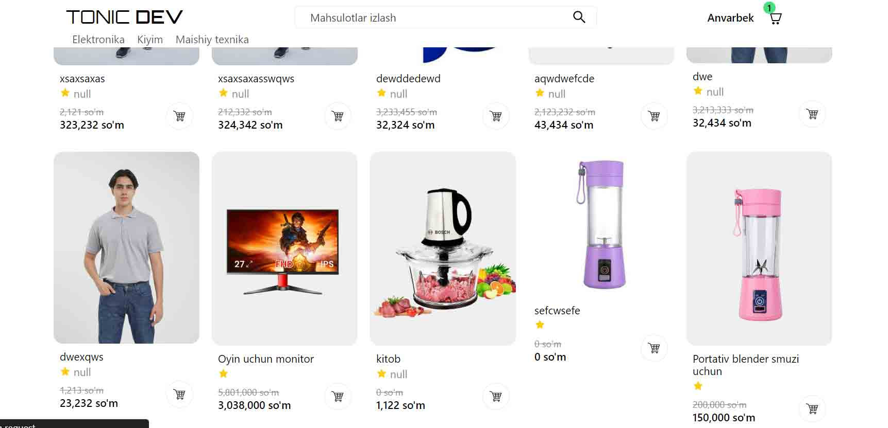
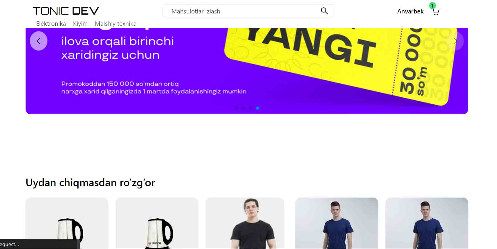
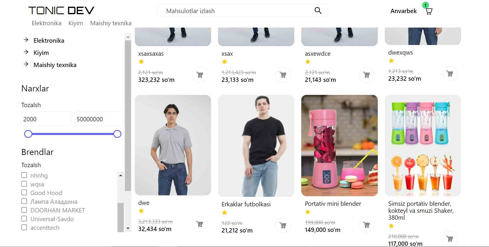
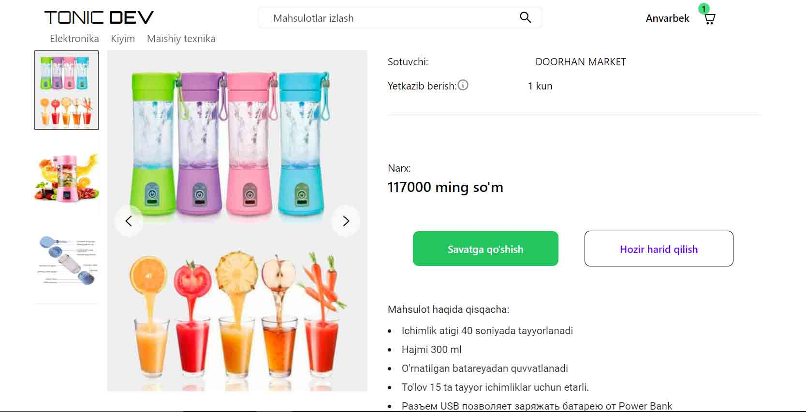
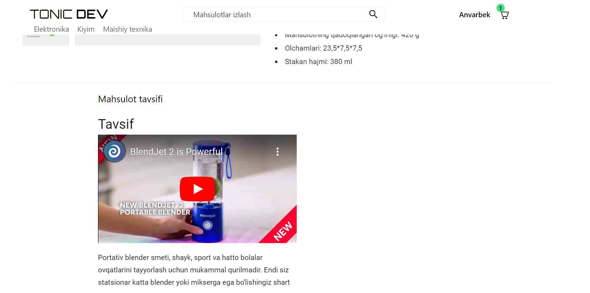
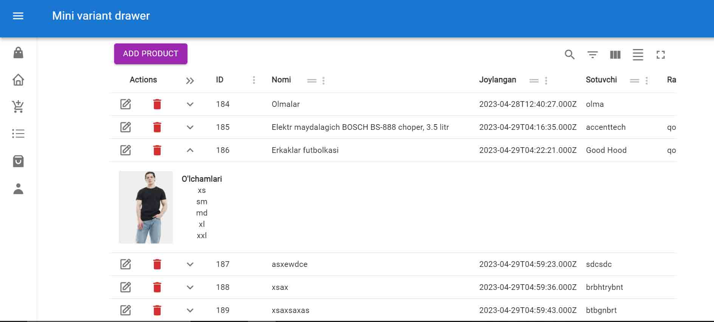
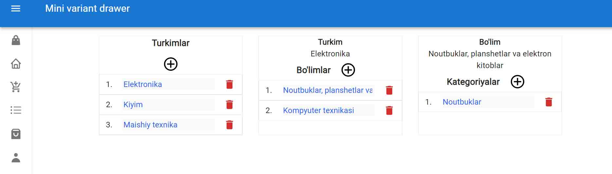
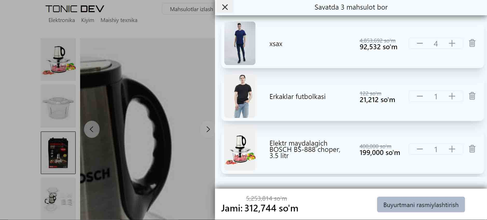
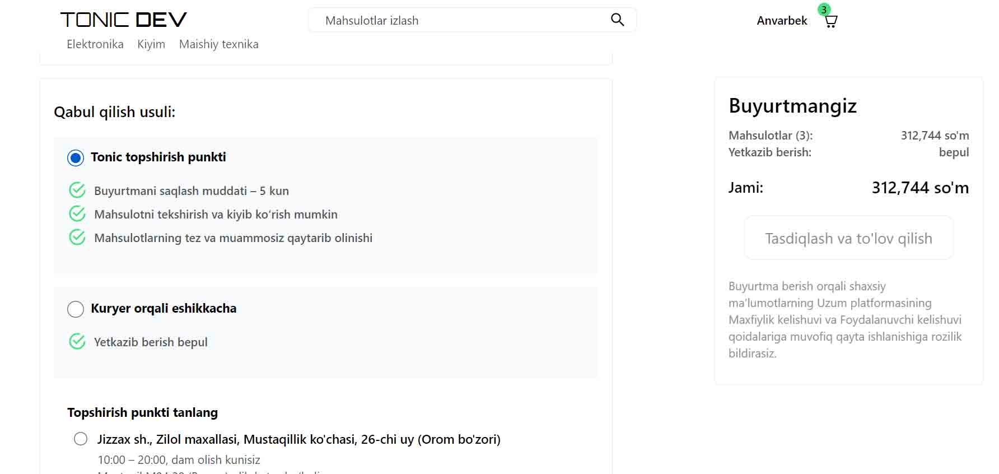

## A great fullstack ecommerce app

<h3><a href="https://github.com/tonicdev07/ecommerce-backend" style="font-size: 32px">Go to the backend</a></h3>

    

      Portfolio
      <a
        style="display: flex; justify-items: center; gap: 4px"
        target="_blank"
        href="https://tonicdev7.netlify.app"
      >
        
        https://tonicdev7.netlify.app</a
      >
    

    

      Follow me
      <a
        target="_blank"
        style="display: flex; justify-items: center; gap: 4px"
        href="https://linkedin.com/tonicdev07"
      >
        
        https://linkedin.com/tonicdev07</a
      >
    

    

      Follow me
      <a
        target="_blank"
        style="display: flex; justify-items: center; gap: 4px"
        href="https://youtube.com/@tonicdev07"
      >
        
        https://youtube.com/@tonicdev07</a
      >
    

    

      Follow me
      <a
        target="_blank"
        style="display: flex; justify-items: center; gap: 4px"
        href="https://github.com/tonicdev07"
      >
        
        https://github.com/tonicdev07</a
      >
    

    

      Follow me
      <a
        target="_blank"
        style="display: flex; justify-items: center; gap: 4px"
        href="https://facebook.com/tonicdev07"
      >
        
        https://facebook.com/tonicdev07</a
      >
    

   

## I what was base technologies are use!

- JavaScript
- React/Vite Js: app router 
- Express Js
- Tailwindcss
- MySql
- Jsonwebtoken
- Headlessui
- And too more..

<h1><a href="https://shop-2fgr.onrender.com" style="font-size: 32px">Demo</a></h1>

## What features does it have

-- USER

- Very good looking ui/ux design
- Advertising banners in the form of a slide
- Product pagination
- Add, remove, update, and check out products in your cart
- Ordering products by size
- There is an excellent multi-functional filtering system
- This works much better from an SEO point of view

-- ADMIN

- Create any product categories, sections, parts
- Attach the product to each section
- Write a perfect beautiful description about the product
- When uploading images, automatically load the image size to the minimum view.
- Get, search, place, update and delete products in a convenient table move
- And more...

